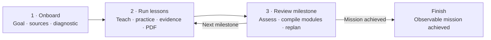

# Adaptive Teach

Adaptive Teach is a stateful teaching skill for long-running learning goals. It
turns a broad objective into an evidence-based curriculum, diagnoses the
learner before planning the first milestone, teaches interactively in chat, and
maintains durable lesson material as verified PDFs.

It is designed for learning and deliberate practice in computing,
mathematics, physics, and languages. It is not intended for one-off
explanations or for managing the execution of an unrelated real-world project.

## Why it exists

A normal teaching conversation can explain a topic well, but it usually has no
durable model of what the learner knows, no explicit prerequisite graph, and no
reliable way to resume after several sessions. Adaptive Teach adds that missing
state.

The skill keeps the destination visible while continually adjusting the next
step from observed performance. A roadmap is therefore a hypothesis, not a
fixed syllabus.

## What it does

- Converts the learner's goal into an observable mission and success evidence.
- Researches trusted curricula and primary sources before defining the
  prerequisite map.
- Runs a mandatory diagnostic assessment of 10–15 primary questions, one at a
  time, with follow-up questions when an answer is ambiguous.
- Records every onboarding question, answer, follow-up, and interpretation.
- Maintains a revisable learner model for individual capabilities.
- Plans the complete journey at low resolution and only the current milestone
  in detail.
- Caps each milestone at three months and replans the next milestone from the
  results of the current one.
- Teaches each lesson interactively in chat and produces one source Markdown
  document plus one verified PDF.
- Runs cumulative milestone assessments and compiles one verified PDF per
  module.
- Resumes interrupted work safely: an unfinished lesson remains `not_done` and
  is repeated under the same stable ID.

## Learning loop



The lesson phase repeats the same stable lesson ID until its evidence and PDF
are complete. Each milestone review then decides whether to adapt the next
milestone or finish the mission.

## Capability model

Adaptive Teach does not reduce knowledge to a single percentage. Each
capability has an evidence-backed state:

| State | Meaning |
|---|---|
| `unknown` | No useful evidence yet, or the learner cannot recognize the concept. |
| `introduced` | The learner recognizes the concept after exposure but cannot yet use it reliably. |
| `fragile` | Partial performance with unstable reasoning, guessing, or important misconceptions. |
| `supported` | The learner has the correct mental model but still needs a reference, prompt, or assistance to execute. |
| `operational` | The learner can explain and apply the capability independently on a fresh task. |
| `retained` | Operational performance survives delay or transfers to a meaningfully different context. |

Ordinary competencies may advance from `supported`. A prerequisite that carries
later reasoning must be `operational` before it is treated as available.

## Chat and PDF have different roles

The chat is the live classroom: explanation, questions, learner attempts,
feedback, and assessment happen there.

Markdown is the canonical teaching source. Every lesson PDF is derived from its
Markdown source and contains the durable theory, motivation, worked examples,
boundaries, misconceptions, practice, and sources. PDFs are reopened,
text-checked, rendered to images, and visually inspected before a lesson can be
marked complete.

At the end of a milestone, completed lesson sources are compiled into one
verified PDF for each module. Derived PDFs must never be edited directly.

## Persistent workspace

The skill creates a `.adaptive-teach/` directory inside the learning project:

```text
.adaptive-teach/
├── .gitignore
├── ONBOARDING.md
├── LEARNER.md
├── ROADMAP.md
├── RESOURCES.md
├── lessons/
├── evidence/
├── modules/
├── output/
│   ├── lessons/
│   └── modules/
└── tmp/
```

The sources of truth have distinct responsibilities:

1. `ONBOARDING.md` preserves the original intake and diagnostic transcript.
2. `LEARNER.md` contains the current, revisable learner hypothesis.
3. `ROADMAP.md` contains the destination and the detailed current milestone.
4. Lesson and module Markdown files contain canonical teaching material.
5. PDFs are derived outputs; chat is transient interaction.

The generated `.gitignore` keeps the learner's course data out of Git by
default. Publishing this skill does not publish a learner's onboarding record,
performance, or generated course.

## Installation

### Codex

Copy or clone this directory into your Codex skills directory:

```bash
mkdir -p ~/.codex/skills
cp -R adaptive-teach ~/.codex/skills/
python3 -m pip install -r ~/.codex/skills/adaptive-teach/scripts/requirements.txt
```

Restart or reload Codex if needed, then invoke the skill explicitly:

```text
$adaptive-teach I want to learn classical mechanics well enough to solve a
first-year university problem set independently.
```

The included `agents/openai.yaml` disables implicit invocation so that a normal
question does not unexpectedly start or modify a persistent course.

### Other skill-compatible agents

The core contract uses Markdown files and Python scripts rather than
Codex-specific APIs. Install the `adaptive-teach/` directory according to the
agent's skill-loading convention and invoke `SKILL.md` explicitly.

`agents/openai.yaml` is Codex-specific metadata and can be ignored elsewhere.
Invocation syntax, tool permissions, and UI integration remain agent-specific;
the course state model and teaching protocols do not.

## Requirements

- Python 3.10 or newer
- [ReportLab](https://www.reportlab.com/) for PDF generation
- [pypdf](https://pypdf.readthedocs.io/) for structural PDF verification
- Poppler's `pdftoppm` or [PyMuPDF](https://pymupdf.readthedocs.io/) for page
  rendering and visual QA
- A Unicode TrueType font for lessons containing non-Latin scripts

Install the Python dependencies with:

```bash
python3 -m pip install -r scripts/requirements.txt
```

The renderer searches common font locations on macOS, Linux, and Windows. Set
`ADAPTIVE_TEACH_FONT` to a Unicode `.ttf` file when the default fonts do not
cover the lesson's writing system.

## Manual utilities

The skill normally runs these utilities itself, but they can also be used for
development and recovery:

```bash
# Create the private runtime workspace in the current project.
python3 scripts/init_workspace.py .

# Check schemas, lesson ordering, evidence, PDFs, and completion invariants.
python3 scripts/validate_workspace.py .

# Render one lesson source.
python3 scripts/render_pdf.py \
  .adaptive-teach/lessons/M01-L01-example.md \
  .adaptive-teach/output/lessons/M01-L01-example.pdf

# Reopen, inspect, and render the PDF to page images.
python3 scripts/verify_pdf.py \
  .adaptive-teach/output/lessons/M01-L01-example.pdf \
  --source .adaptive-teach/lessons/M01-L01-example.md
```

## Development and validation

From the directory containing `adaptive-teach/`:

```bash
python3 -m pip install -r adaptive-teach/scripts/requirements.txt
python3 -m unittest discover -s adaptive-teach/tests -v
```

The tests cover workspace privacy, malformed state, interrupted lesson
ordering, lesson PDF completion invariants, and module compilation without
modifying canonical lesson sources.

## Repository structure

```text
adaptive-teach/
├── SKILL.md                 # Small controller and invariant set
├── README.md                # Public project documentation
├── agents/openai.yaml       # Codex display and invocation metadata
├── assets/workspace/        # Runtime templates
├── references/              # Phase, state, source, PDF, and domain protocols
├── scripts/                 # Initialization, validation, rendering, and QA
└── tests/                   # Automated behavioral checks
```

The public interface is one skill. Internally, the controller loads only the
protocol needed for the current phase, keeping onboarding, lesson execution,
milestone assessment, and artifact generation separate without requiring the
user to coordinate multiple skills.

## Current scope and limitations

- Version 1 supports computing, mathematics, physics, and languages.
- Source quality still depends on access to appropriate curricula and primary
  references.
- Capability placement is an evidence-backed model, not a psychometric
  measurement or formal certification.
- Retention requires delayed evidence; it cannot be inferred from immediate
  performance.
- Workload estimates remain ranges and are recalibrated from observed effort.
- PDF generation can verify structure and flag suspicious layouts, but final
  visual inspection remains part of the completion protocol.

## Design principle

> Preserve the destination, adapt the next step.

Adaptive Teach does not promise a perfectly predicted curriculum. It promises
that every next milestone is based on the best available evidence about the
learner, the domain, and the work completed so far.
